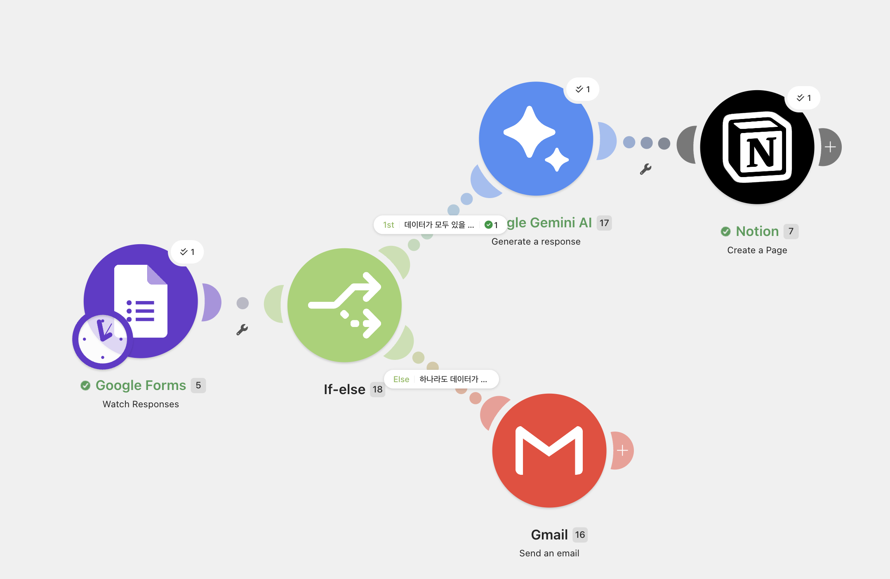
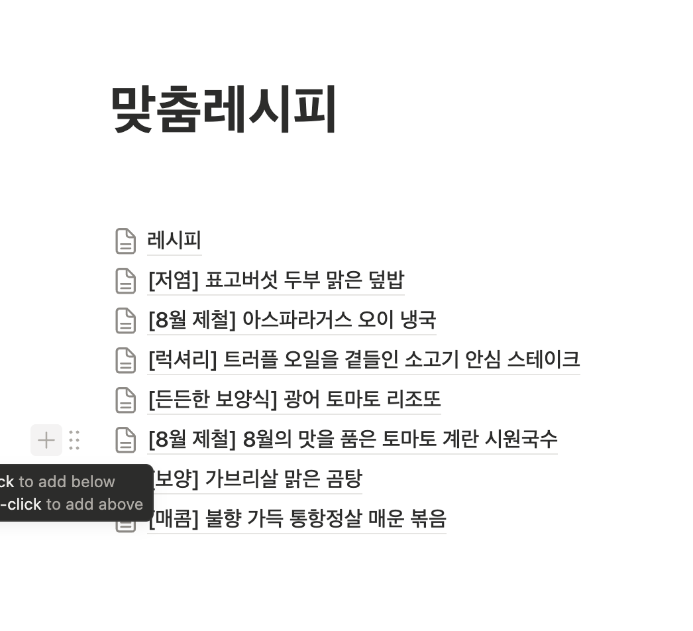
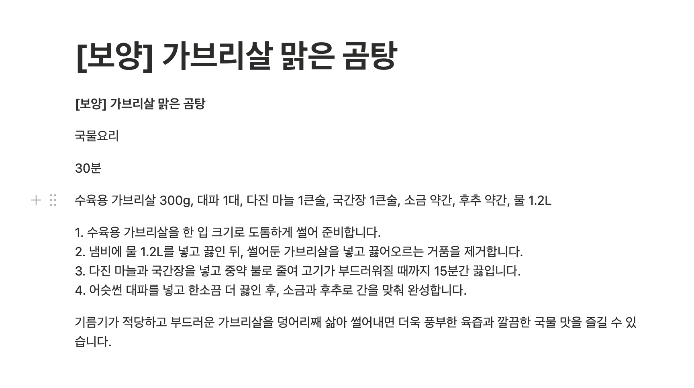

<!-----

Conversion time: 2.562 seconds.

Using this Markdown file:

1. Paste this output into your source file.
2. See the notes and action items below regarding this conversion run.
3. Check the rendered output (headings, lists, code blocks, tables) for proper
   formatting and use a linkchecker before you publish this page.

Conversion notes:

* Docs™ to Markdown version 2.0β2
* Sat Aug 08 2026 02:57:40 GMT-0700 (미 태평양 하계 표준시)
* Source doc: [프로젝트 1] 자동화 도구 비교 분석 보고서
* Tables are currently converted to HTML tables.
----->

# [프로젝트 1] 자동화 도구 비교 분석 보고서: 레시피 추천 자동화

## 1. 개요

본 보고서는 사용자의 재료와 취향을 기반으로 맞춤형 레시피를 제안하는 워크플로우를 **Make**와 **Zapier** 두 가지 자동화 도구로 구현하고 비교한 결과를 담고 있습니다.

## 2. 워크플로우 구조

동일한 워크플로우 구조를 적용하여 두 도구의 특성을 비교했습니다.

* **Trigger:** Google Forms – 설문 응답 제출
* **Filter/Router:** 특정 재료 포함 여부 또는 스타일 기반 조건 분기
* **Action 1:** Gmail – 자동 응답 메일 발송 (레시피 정보 포함)
* **Action 2:** Google Sheets – 응답 이력 데이터 기록

## 3. 도구별 구현 요약

### Make

시각적인 노드(Node) 기반 인터페이스를 통해 데이터 흐름을 직관적으로 설계했습니다. 복잡한 조건 분기(Router)를 생성하기 용이하며, 데이터 매핑 시 개별 단계의 값을 확인하기 매우 편리했습니다.

### Zapier

리스트(List) 형태의 단계별 설정을 지원하여 흐름을 순차적으로 파악하기에 매우 쉽습니다. 인터페이스가 깔끔하여 빠른 설정이 가능하며, 대중적인 서비스들과의 연동 안정성이 매우 높습니다.

## 4. 비교 분석

<table>
  <tr>
   <td>비교 항목
   </td>
   <td>Make
   </td>
   <td>Zapier

 
   </td>
  </tr>
  <tr>
   <td><strong>UI/UX</strong>
   </td>
   <td>캔버스 위 노드 연결 방식 (시각적)
   </td>
   <td>단계별 리스트 방식 (순차적)
   </td>
  </tr>
  <tr>
   <td><strong>설정 난이도</strong>
   </td>
   <td>학습 곡선 있음 (고급 기능 강점)
   </td>
   <td>매우 낮음 (초보자 친화적)
   </td>
  </tr>
  <tr>
   <td><strong>연동 서비스 범위</strong>
   </td>
   <td>매우 광범위하고 세부 설정 가능
   </td>
   <td>매우 방대하며 빠른 연동 지원
   </td>
  </tr>
  <tr>
   <td><strong>무료 플랜 범위</strong>
   </td>
   <td>월 1,000 Ops (비교적 넉넉함)
   </td>
   <td>월 100 Tasks (제한적)
   </td>
  </tr>
  <tr>
   <td><strong>실행 로그 확인</strong>
   </td>
   <td>단계별 실시간 데이터 확인 가능
   </td>
   <td>Task History를 통한 이력 조회
   </td>
  </tr>
</table>

## 5. 결론 및 제언

### 각 도구의 장단점

* **Make:** 복잡한 워크플로우를 자유롭게 설계할 수 있으나, 초기 설정 시 인터페이스 적응 기간이 필요합니다. 무료 플랜의 가성비가 매우 뛰어납니다.
* **Zapier:** 사용법이 매우 직관적이고 빠르게 결과를 낼 수 있습니다. 하지만 무료 플랜의 작업 수 제한이 엄격하여 본격적인 자동화 시 유료 플랜 고려가 필수적입니다.

### 적합한 상황 의견

* **Make 추천:** 복잡한 조건 분기가 포함된 자동화, 데이터 처리가 많은 워크플로우, 비용 효율적인 운영이 중요한 경우.
* **Zapier 추천:** 빠른 서비스 연동 및 구현이 필요한 경우, 노코드 입문자, 유지보수를 최소화하고 즉각적인 자동화를 원하는 경우.

<!-----

You have some errors, warnings, or alerts. If you are using reckless mode, turn it off to see useful information and inline alerts.
* ERRORs: 0
* WARNINGs: 0
* ALERTS: 2

Conversion time: 1.659 seconds.

Using this Markdown file:

1. Paste this output into your source file.
2. See the notes and action items below regarding this conversion run.
3. Check the rendered output (headings, lists, code blocks, tables) for proper
   formatting and use a linkchecker before you publish this page.

Conversion notes:

* Docs™ to Markdown version 2.0β2
* Sat Aug 08 2026 02:56:32 GMT-0700 (미 태평양 하계 표준시)
* Source doc: [프로젝트 2] 자유 주제 자동화 설계 및 구현 보고서
* This document has images: check for >>>>>  gd2md-html alert:  inline image link in generated source and store images to your server. NOTE: Images in exported zip file from Google Docs may not appear in  the same order as they do in your doc. Please check the images!

----->

>>>>>  gd2md-html alert:  ERRORs: 0; WARNINGs: 0; ALERTS: 2.

<ul style="color: red; font-weight: bold"><li>See top comment block for details on ERRORs and WARNINGs. <li>In the converted Markdown or HTML, search for inline alerts that start with >>>>>  gd2md-html alert:  for specific instances that need correction.</ul>

Links to alert messages:
<a href="#gdcalert1">alert1</a>
<a href="#gdcalert2">alert2</a>

>>>>> PLEASE check and correct alert issues and delete this message and the inline alerts.

# [프로젝트 2] 자유 주제 자동화 설계 및 구현 보고서: 레시피 자동화 및 데이터 검증

## 1. 자동화 반복 업무 정의

**업무명:** 구글 설문 데이터 기반 레시피 자동 생성 및 데이터 누락 감지 알림

**내용:** 사용자가 구글 설문지를 통해 재료와 요리 스타일을 제출하면, 해당 데이터를 활용해 Notion에 상세 레시피를 자동으로 기록합니다. 만약 제출된 데이터 중 필수 항목이 누락된 경우, 자동으로 Gmail을 통해 관리자에게 오류 알림을 전송하여 데이터 누락을 방지합니다.

## 2. 선정 도구 및 이유

**선정 도구:** Make (구 Integromat)

**선정 이유:**

* **시각적 조건 분기:** Router 기능을 통해 데이터의 유효성(데이터 존재 여부)에 따라 경로를 분기하는 과정이 매우 직관적입니다.
* **다양한 연동성:** Google Forms, Gemini AI, Notion, Gmail 등 다양한 서비스를 하나의 워크플로우로 묶어 복잡한 로직을 손쉽게 구현할 수 있습니다.
* **효율적인 무료 플랜:** 반복 업무를 무료 Ops 범위 내에서 충분히 효율적으로 관리할 수 있습니다.

## 3. 워크플로우 흐름 설명

* **Trigger:** Google Forms – Watch Responses (새로운 설문 응답이 들어오면 워크플로우 시작)
* **조건 분기 (If-else/Filter):**
    * **정상 경로:** 모든 답변 항목이 채워진 경우, Gemini AI가 레시피를 생성하고 Notion 페이지를 생성합니다.
    * **오류 경로:** 답변이 하나라도 비어있는 경우, Gmail 모듈이 트리거되어 오류 통보 메일을 전송합니다.

## 4. 구현 화면 및 실행 결과

### 워크플로우 구성 (Make 시나리오)

Make 내에서 Google Forms를 트리거로 설정하고, If-else 라우터를 통해 레시피 생성 경로와 오류 알림 경로를 구분하였습니다.

### 실행 결과 (Notion 페이지)

정상 제출된 데이터에 대해 생성된 노션 레시피 페이지('[8월 제철] 8월의 맛을 품은 토마토 계란 시원국수')를 확인하였습니다.

  
  

